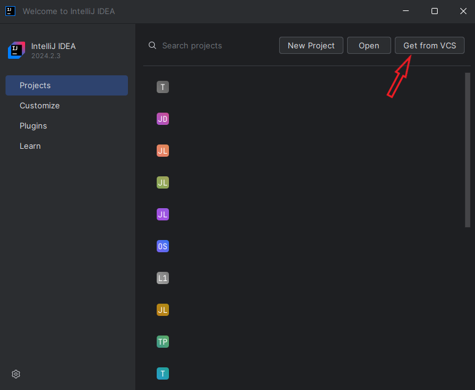
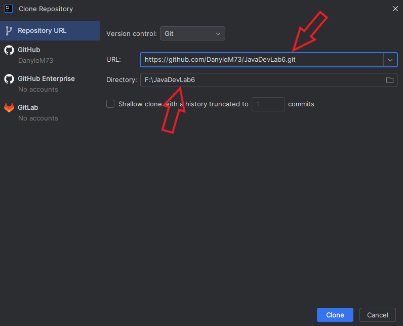
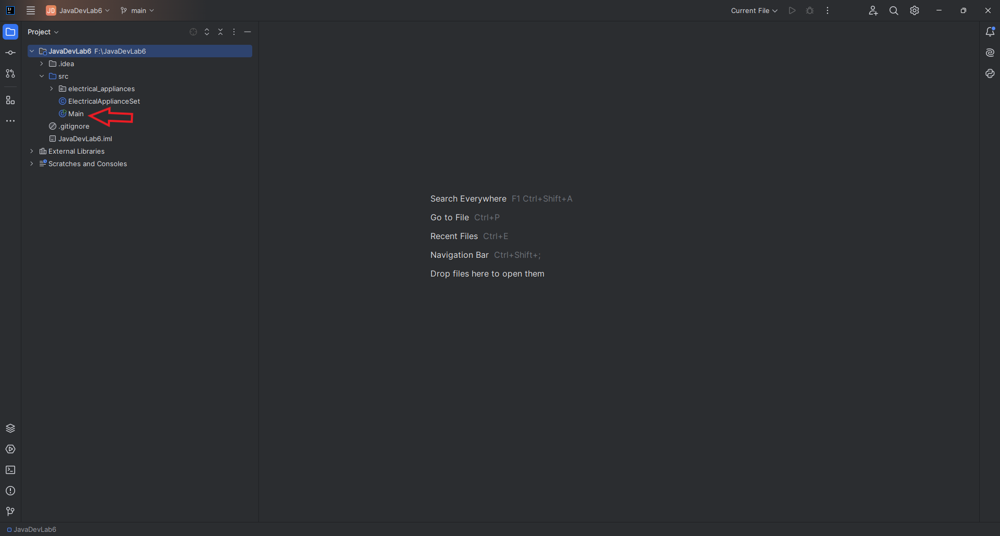
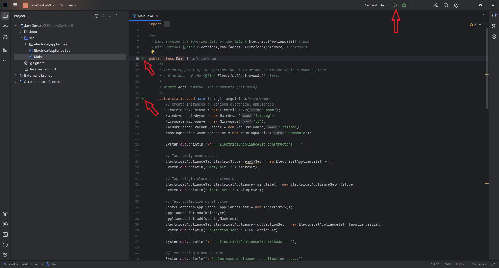
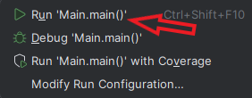
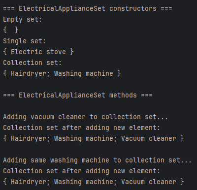
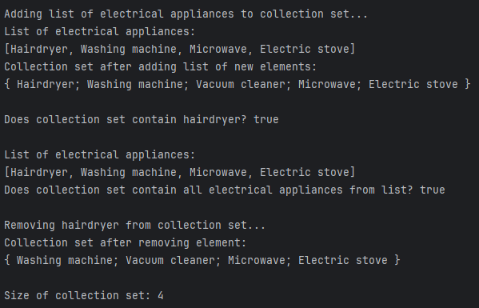
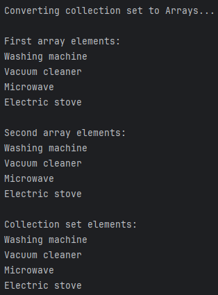
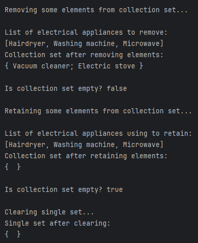

# Розробка програмного забезпечення на платформі Java

## Лабораторна робота №6

### Інструкція зі встановлення та першого запуску

_Застосунок було написано в Intellij IDEA, тому тут буде надана інструкція з інсталювання додатка саме через цю IDE._

1. **Клонувати цей репозиторій на свою локальну машину.**

У початковому вікні Intellij IDEA треба натиснути кнопку `Get from VCS`.

У наступному вікні потрібно вказати посилання на цей репозиторій та шлях до директорії, у якій цей репозиторій буде клоновано.

2. **Запустити додаток.**

Треба відкрити файл `Main.java`.

Тоді стануть доступними кнопки для запуску додатка.

При натисканні кнопки запуску зліва від коду в діалоговому вікні потрібно вибрати перший пункт.

### Інформація щодо роботи додатка

У виконавчому методі програми відбувається перевірка на правильність роботи як конструкторів, так і методів новоствореної колекії.